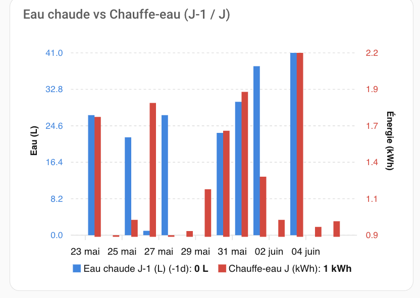
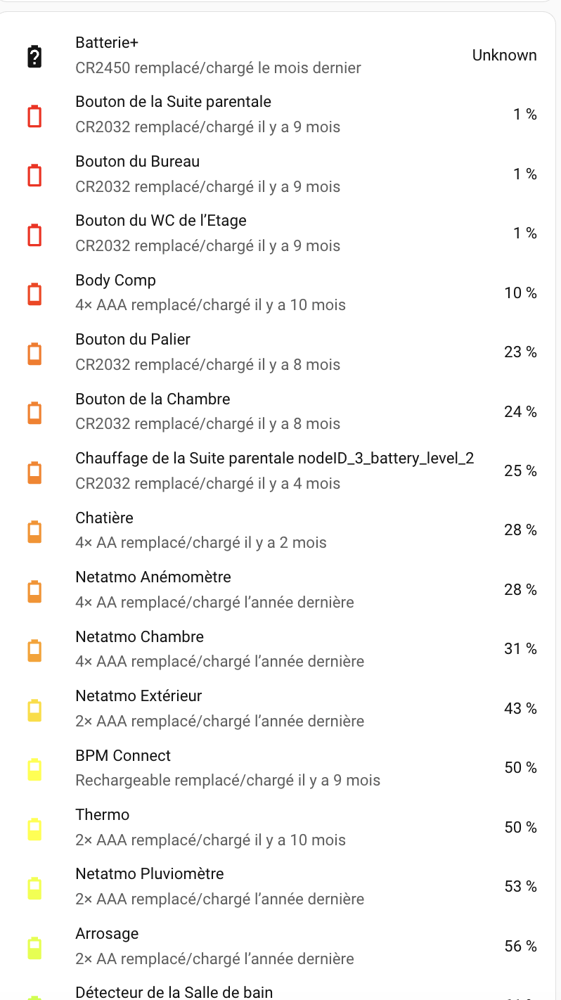
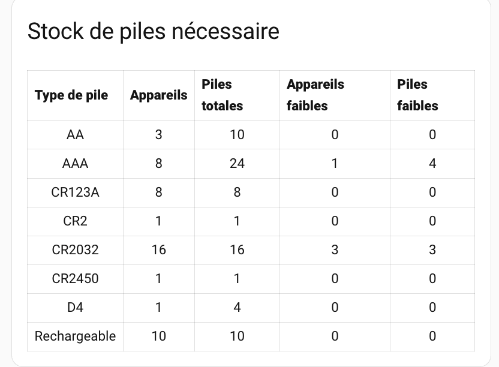
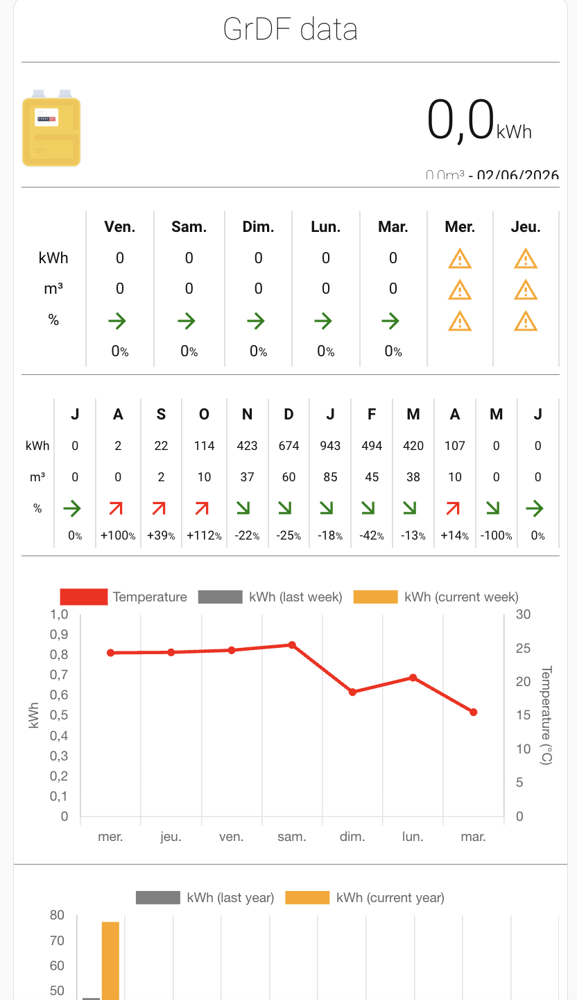

# 🛠️ HACS — Intégrations & Cartes Lovelace

[← Retour README](../README.md)

---

## Intégrations (19)

### Alexa Media Player
> [GitHub](https://github.com/alandtse/alexa_media_player) — `domain: alexa_media`

Contrôle des appareils Amazon Alexa via l'API non officielle.

---

### Atmo France
> [GitHub](https://github.com/sebcaps/atmofrance) — `domain: atmofrance`

Qualité de l'air pour les villes françaises depuis Atmo France.

**Configuration :**
- Ville : [Votre ville]

---

### Battery Notes
> [GitHub](https://github.com/andrew-codechimp/HA-Battery-Notes) — `domain: battery_notes`

Suivi des types et dates de remplacement des batteries.

**Utilisation :** Automations `battery_low_notification`, `daily_battery_low_check`, `battery_increased_notification`.

---

### Dyson Local
> [GitHub](https://github.com/libdyson-wg/ha-dyson) — `domain: dyson_local`

Intégration locale (sans cloud) des appareils Dyson.

**Appareils configurés :**
- Dyson Pure Hot + Cool (purificateur/chauffage Salon) — `fan.salon`
- Dyson Pure Cool (Bureau) — `fan.chambre_principale`

---

### Ecodevices RT2
> [GitHub](https://github.com/pcourbin/ecodevices_rt2) — `domain: ecodevices_rt2`

Intégration pour le module de mesure GCE Ecodevices RT2.

**Fichier `/homeassistant/packages/ecodevices_rt2.yaml` :**

```yaml
ecodevices_rt2:
 - name: EcoRT2
   host: "<ip_ecodevices>"
   port: 80
   api_key: <api_key>
   update_after_switch: 0.1
   scan_interval: 15
   devices:
     - name: Compteur Eau froide
       type: "counter"
       icon: mdi:water
       device_class: water
       unit_of_measurement: 'L'
       id: 1
     - name: Compteur Eau Chaude
       type: "counter"
       icon: mdi:water
       device_class: water
       unit_of_measurement: 'L'
       id: 2
     - name: Compteur GAZ
       type: "counter"
       icon: mdi:fire
       device_class: gas
       unit_of_measurement: 'm³'
       id: 3
     #### Post et Sub-Post
     - name: Tele-Info
       type: "post"
       id: 1
       subpost: 0
     - name: Autre PC
       type: "post"
       id: 5
       subpost: 0
     - name: Chaudière
       type: "post"
       id: 2
       subpost: 0
     - name: Chauffe eau
       type: "post"
       id: 2
       subpost: 1
     - name: PC Réseau
       type: "post"
       id: 3
       subpost: 0
     - name: Eclairage
       type: "post"
       id: 6
       subpost: 0
     - name: Volets
       type: "post"
       id: 5
       subpost: 1
     - name: PC LL et SL
       type: "post"
       id: 5
       subpost: 2
     - name: VMC
       type: "post"
       id: 5
       subpost: 3
     - name: Four
       type: "post"
       id: 4
       subpost: 0
     - name: Plaque
       type: "post"
       id: 4
       subpost: 1
     - name: PC Lave vaisselle
       type: "post"
       id: 4
       subpost: 4
     - name: PC Cuisine+Ext
       type: "post"
       id: 4
       subpost: 3
     - name: PC Poêle
       type: "post"
       id: 2
       subpost: 2
     - name: Armoire Ecodevice RT2
       type: "post"
       id: 3
       subpost: 1
     - name: Cabane
       type: "post"
       id: 3
       subpost: 2
     - name: Production
       type: "post"
       id: 8
       subpost: 0
     #### Tele-Information
     - name: Index Base (EDF Info)
       type: "supplierindex"
       id: 1
```

---

### EcoFlow Cloud
> [GitHub](https://github.com/snell-evan-itt/hassio-ecoflow-cloud-US) — `domain: ecoflow_cloud`

Intégration cloud pour les appareils EcoFlow (batterie DELTA Max + PowerStream).

> ⚠️ Erreur connue : incompatibilité avec la version actuelle de paho-mqtt. Mise à jour requise.

---

### HACS
> [GitHub](https://github.com/hacs/integration) — `domain: hacs`

Home Assistant Community Store — gestionnaire de contenu communautaire.

---

### Local Agenda
> [GitHub](https://github.com/slemeur91/local_agenda) — `domain: local_agenda`

Intégration de calendriers locaux enrichis pour la planification de l'agenda domotique.

**Calendriers configurés :**
- Agenda Travail
- Agenda Télétravail
- Agenda Absent
- Agenda WE-Férié-Repos
- Agenda Permanent

---

### Micronova Agua IOT
> [GitHub](https://github.com/vincentwolsink/home_assistant_micronova_agua_iot) — `domain: aguaiot`

Contrôle des poêles à granulés connectés via la plateforme Agua IOT.

> ℹ️ Intégration désactivée — la prise de la pellet stove est coupée pour économies d'énergie.

---

### My EcoWatt by RTE
> [GitHub](https://github.com/kamaradclimber/rte-ecowatt) — `domain: rte_ecowatt`

Données EcoWatt de RTE (signaux de sobriété électrique).

---

### Orange Livebox
> [GitHub](https://github.com/cyr-ius/hass-livebox-component) — `domain: livebox`

Supervision de la Livebox Orange (état WAN, appareils connectés).

---

### pyscript
> [GitHub](https://github.com/custom-components/pyscript) — `domain: pyscript`

Scripts Python avancés dans Home Assistant.

**Scripts utilisés :**
- `gazpar_update` : injection des statistiques GAZPAR
- `surveillance_station_recording` : contrôle de l'enregistrement des caméras Synology

---

### Remote Home-Assistant
> [GitHub](https://github.com/custom-components/remote_homeassistant) — `domain: remote_homeassistant`

Liaison entre deux instances Home Assistant.

**Configuration :**
- Instance distante : `192.168.51.34:8123` (instance secondaire)

> ⚠️ Sur l'instance distante, ajouter dans `configuration.yaml` :
> ```yaml
> remote_homeassistant:
>   instances:
> ```

---

### RfPlayer
> [GitHub](https://github.com/gce-electronics/HA_RFPlayer) — `domain: rfplayer`

Intégration du module GCE Electronics RFPlayer (réception/émission RF 433/868 MHz).

**Utilisation :** Détection du brouillage réseau RF (`binary_sensor.jamming_0_detector`).

---

### Somfy Protexial
> [GitHub](https://github.com/AuroreVgn/somfy-protexial) — `domain: somfy_protexial`

Intégration de la centrale d'alarme Somfy Protexial/Protexiom.

**Configuration :**
- URL : `http://[IP locale]:80`
- Entité principale : `alarm_control_panel.alarme`

---

### Spook
> [GitHub](https://github.com/frenck/spook) — `domain: spook`

Boîte à outils avancée pour Home Assistant (services supplémentaires, détection entités orphelines).

**Utilisation :** `script.delete_all_orphaned_entities` utilise `homeassistant.delete_all_orphaned_entities` fourni par Spook.

---

### Vacances Scolaires
> [GitHub](https://github.com/Master13011/vacances-scolaire-HA) — `domain: vacances_scolaires`

Calendrier des vacances scolaires françaises.

**Configuration :**
- Zone : C (Île-de-France)

---

### Xiaomi Miot
> [GitHub](https://github.com/al-one/hass-xiaomi-miot) — `domain: xiaomi_miot`

Intégration de tous les appareils Xiaomi/Mi via le protocole MiOT.

**Appareils configurés :**
- Moniteur PM2.5 (米家PM2.5检测仪) — `sensor.zhimi_v1_5052_pm25_density`
- Purificateur Mi Air — `fan.zhimi_m1_6186_air_purifier`

---

### xsense
> [GitHub](https://github.com/Jarnsen/ha-xsense-component_test) — `domain: xsense`

Intégration des appareils X-Sense (station de sécurité SBS50, détecteurs de fumée/CO).

---

## Cartes Lovelace (7)

### apexcharts-card
> [GitHub](https://github.com/RomRider/apexcharts-card)

Graphiques avancés basés sur ApexCharts. Utilisé pour les graphiques de consommation énergie.

**Exemple — Eau chaude vs Chauffe-eau :**

> Compare la consommation d'eau chaude du jour J (en litres) avec la consommation électrique du chauffe-eau du jour J+1 (en kWh). La consommation d'eau J est décalée de -1j pour être alignée avec la chauffe électrique qui s'effectue le lendemain.

```yaml
type: custom:apexcharts-card
graph_span: 14d
span:
  end: day
update_interval: 1h
header:
  show: true
  title: Eau chaude vs Chauffe-eau (J-1 / J)
  show_states: false
apex_config:
  chart:
    type: bar
  plotOptions:
    bar:
      columnWidth: 70%
series:
  - entity: sensor.compteur_eau_chaude_index
    name: Eau chaude J-1 (L)
    color: "#1E88E5"
    type: column
    statistics:
      type: change
      period: day
    unit: L
    yaxis_id: water
    offset: "-1d"
    transform: "return x < 0 ? 0 : Math.round(x);"
  - entity: sensor.chauffe_eau_index
    name: Chauffe-eau J (kWh)
    color: "#E53935"
    type: column
    statistics:
      type: change
      period: day
    unit: kWh
    yaxis_id: energy
    transform: "return x < 0 ? 0 : Math.round(x * 100) / 100;"
yaxis:
  - id: water
    apex_config:
      title:
        text: Eau (L)
      labels:
        style:
          colors: "#1E88E5"
  - id: energy
    opposite: true
    apex_config:
      title:
        text: Énergie (kWh)
      labels:
        style:
          colors: "#E53935"
```



### Battery State Card
> [GitHub](https://github.com/maxwroc/battery-state-card)

Tableau de bord des niveaux de batteries de tous les appareils.

**Configuration utilisée :**
```yaml
type: custom:battery-state-card
secondary_info: >-
  {attributes.battery_type_and_quantity} remplacé/chargé
  {attributes.battery_last_replaced|reltime()}
round: 0
entities:
  - sensor.chauffage_de_la_chambre_battery_plus
  - sensor.chauffage_de_la_chambre_nodeid_6_battery_level_2_battery_plus
  - sensor.chauffage_de_la_salle_d_eau_battery_plus
  - sensor.chauffage_de_la_salle_d_eau_nodeid_4_battery_level_2_battery_plus
  - sensor.chauffage_de_la_salle_de_bain_battery_plus
  - sensor.chauffage_de_la_salle_de_bain_nodeid_5_battery_level_2_battery_plus
  - sensor.chauffage_de_la_suite_parentale_battery_plus
  - sensor.chauffage_de_la_suite_parentale_nodeid_3_battery_level_2_battery_plus
  - sensor.chauffage_du_bureau_battery_plus
  - sensor.chauffage_du_bureau_nodeid_2_battery_level_2_battery_plus
filter:
  include:
    - name: entity_id
      value: "*_battery_plus"
bulk_rename:
  - from: " Batterie+"
    to: ""
sort:
  by: state
collapse: 60
```



### card-mod
> [GitHub](https://github.com/thomasloven/lovelace-card-mod)

Permet d'ajouter du CSS personnalisé à n'importe quelle carte Lovelace.

**Configuration utilisée — carte stock de piles :**
```yaml
type: vertical-stack
cards:
  - type: custom:mod-card
    card_mod:
      style: |
        ha-markdown {
          text-align: center;
          font-family: monospace;
          font-size: 14px;
        }
    card:
      type: markdown
      title: Stock de piles nécessaire
      content: >-
        
        
        
          
        
          
          
          
          
          
        
        {{ ns.out }}
```



### Custom-ui
> [GitHub](https://github.com/Mariusthvdb/custom-ui)

Templates et couleurs d'icônes personnalisés dans l'interface HA.

### expander-card
> [GitHub](https://github.com/MelleD/lovelace-expander-card)

Carte extensible/rétractable pour organiser les dashboards.

### GrDF Gazpar card
> [GitHub](https://github.com/ssenart/lovelace-gazpar-card)

Carte dédiée à l'affichage des données GAZPAR (consommation gaz).

**Configuration utilisée :**
```yaml
type: custom:gazpar-card
entity: sensor.gazpar_cheptainville_card
showCost: false
showCostHistory: false
showDailyCostHistoryChart: false
showWeeklyCostHistoryChart: false
showMonthlyCostHistoryChart: false
showYearlyCostHistoryChart: false
```



### Waze Travel Time Card
> [GitHub](https://github.com/r-renato/ha-card-waze-travel-time)

Affiche le temps de trajet calculé par Waze.
